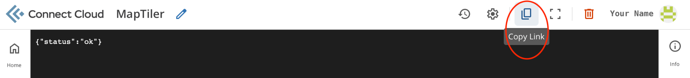
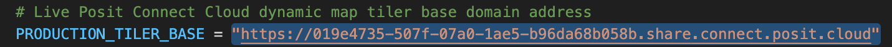
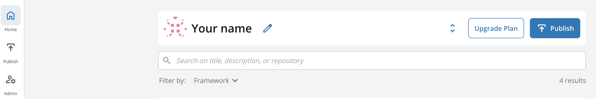
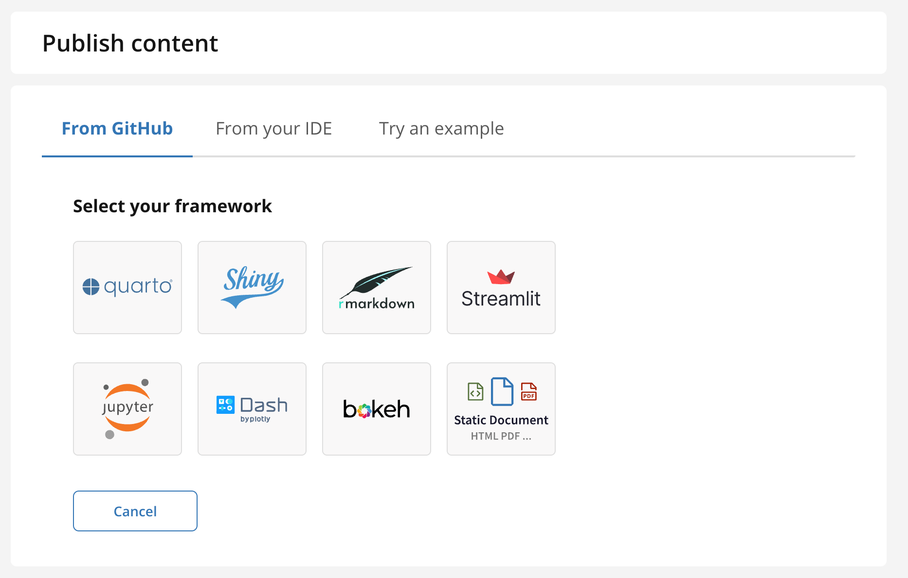
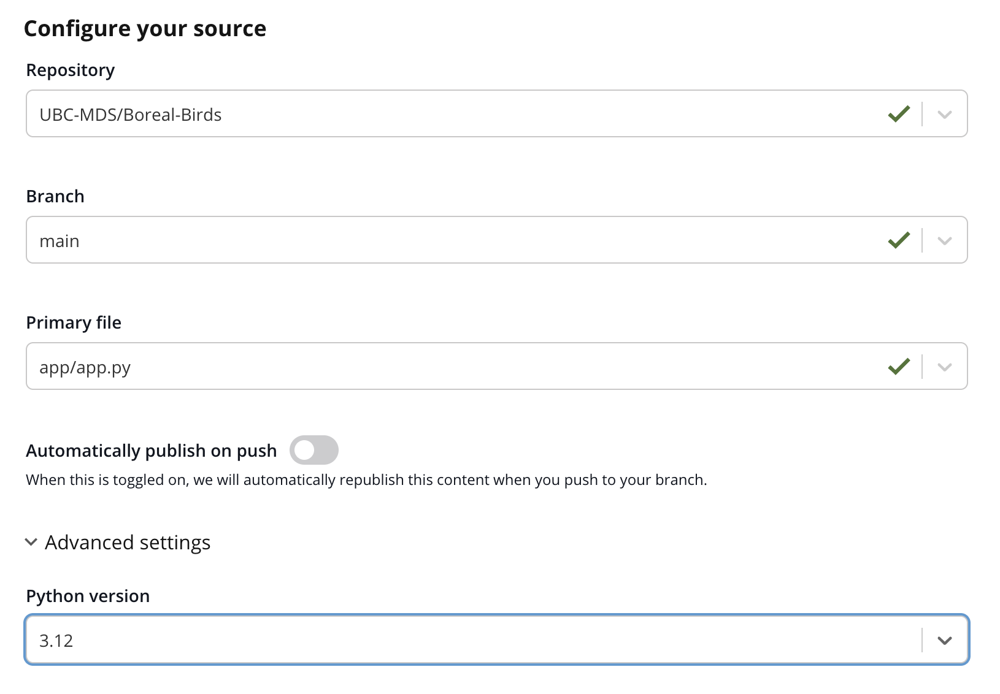
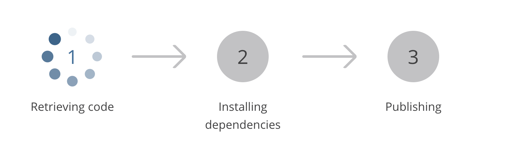

# First Steps

This is a general guideline to deploy the dashboard on to posit connect cloud. We need to deploy 2 apps for the dashboard to be functional:

1. Main Dashboard
    - [GitHub Repository](https://github.com/UBC-MDS/Boreal-Birds/)
2. TiTiler API: 
    - [GitHub Repository](https://github.com/UBC-MDS/MapTiler)
    - The TiTiler API powers dynamic tiling in the dashboard by converting remote COG rasters into web map tiles on demand. 

## Instructions
1. Clone/Fork the 2 github repositories above
2. Deploy the Titiler API on Posit Connect Cloud
3. Copy the link of the deployed Titiler API

4. Update `PRODUCTION_TILER_BASE` in the Main Dashboard located in `app/shared.py` to the link of the deployed app obtained from the previous step.

5. Commit/Push the updated link to the Main Dashboard repository
6. Deploy the Main Dashboard on Posit Connect Cloud

## Notes
- Please follow the instructions in [Posit Connect Cloud Deployment](#posit-connect-cloud-deployment) to see how to deploy an app on Posit Connect Cloud
- Shiny is used as the deployment framework for both Apps

# Posit Connect Cloud Deployment
#### 1. Create an account. [https://connect.posit.cloud/](https://connect.posit.cloud/) 

#### 2. Navigate to the home page.

#### 3. Select “Publish” from either the sidebar or blue button to the right of your name.

#### 4. Under “From GitHub”, select “Shiny” as your framework.

#### 5. Configure your source
1. Repositories must be public (for free accounts).
2. Branch can be anything that is visible on the remote.
3. Primary file can be anywhere - you will simply point to `app/app.py`.
    - `requirements.txt` should be found along this path. But it will tell you if it cannot be found.
4. Auto-push - instructions will be provided by Posit. Usually, we have ‘dev’ on auto, and ‘main’ not.
5. We’ve decided on Python 3.12.
6. There are additional settings, but not used in our case.

#### 6. Select “Publish.” Posit will do its processes and if there is an issue provide logs for tracing.

