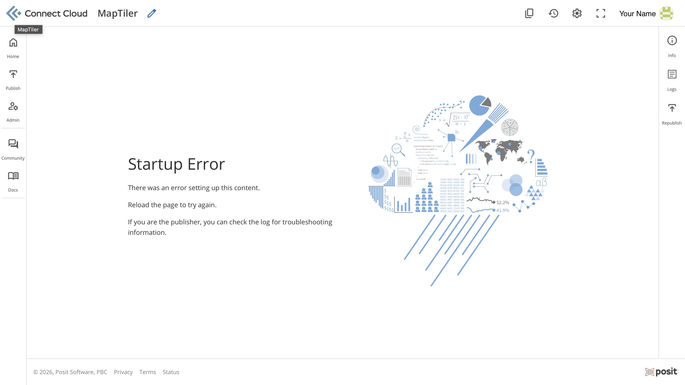
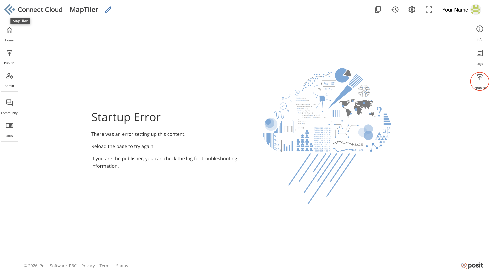

# TiTiler Unavailable

This issue occurs when the dashboard fails to load raster layers and requests to the TiTiler API return errors or time out.

Within the dashboard, this condition is displayed as HTML on the map as follows:

> **Map service starting**
>
> The raster tiling service (TiTiler API) is currently unavailable. Please try again in a few minutes.

When accessing the deployed API application on [Posit Connect Cloud](https://connect.posit.cloud), you may encounter a **Startup Error** message similar to the example below.

This issue prevents TiTiler from serving map tiles until the application is restarted successfully.

The underlying cause is currently unclear. Based on observed behavior, the issue may be related to application inactivity or platform-managed restarts within Posit Connect Cloud.

The issue is typically temporary and does not appear to be caused by problems with the dashboard configuration, raster data, or Cloud Optimized GeoTIFF (COG) files.

In many cases, [Posit Connect Cloud](https://connect.posit.cloud) automatically attempts to restart the application after some time.

## Resolution

### Option 1: Wait for Automatic Recovery

If the dashboard displays the **Map service starting** message:

1. Wait a few minutes.
2. Refresh the dashboard.
3. Refresh the dashboard and verify that raster layers load successfully.

Posit Connect Cloud may automatically restart the application without requiring user intervention.

### Option 2: Republish the Application

If immediate recovery is required, manually republish the TiTiler application.

1. Open the [Posit Connect Cloud](https://connect.posit.cloud) dashboard.
2. Navigate to the deployed TiTiler application.
3. Republish the existing application.

4. Wait for the deployment process to complete.
5. Refresh the dashboard and verify that raster layers load successfully.

## Additional Information

If the application continues to fail after multiple republish attempts, review the application logs in [Posit Connect Cloud](https://connect.posit.cloud) to identify potential deployment or runtime errors unrelated to this intermittent startup issue.

For other dashboard messages, refer to the following status descriptions:

|        Status       |              Message                |
| ------------------- | ----------------------------------- |
| `loading`           | **Loading Raster ...**              |
| `tiler_starting`    | **Loading raster** — Initializing selected raster. |
| `tiler_unavailable` | **Map service starting** — The raster tiling service (TiTiler API) is currently unavailable. Please try again in a few minutes. |
| `missing`           | **Raster unavailable** — The requested raster file could not be found. |

#### Additional Resources

* [Posit Connect Documentation - Troubleshooting](https://docs.posit.co/connect/user/troubleshooting/)