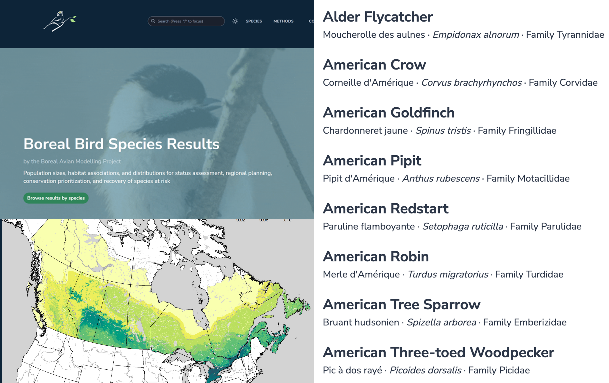
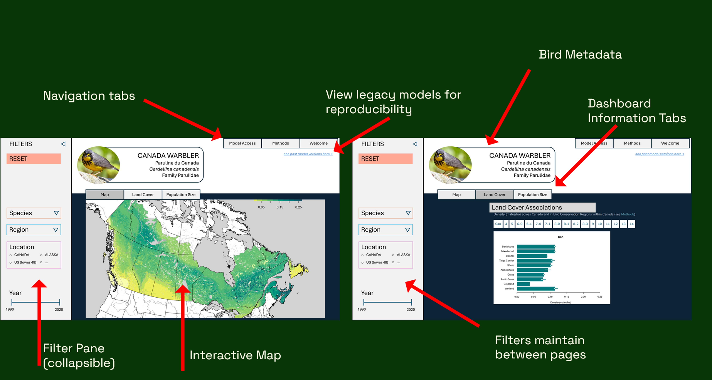
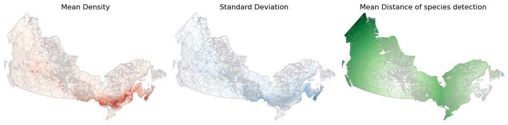
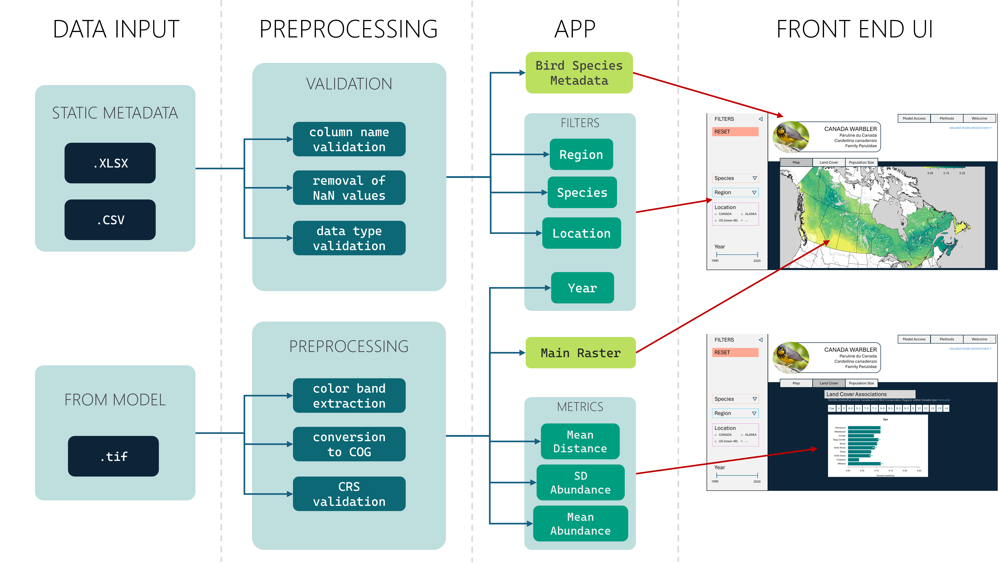
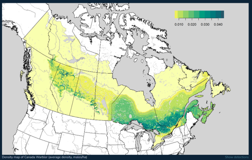
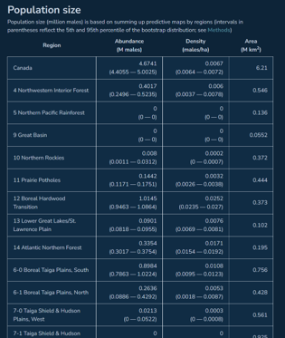
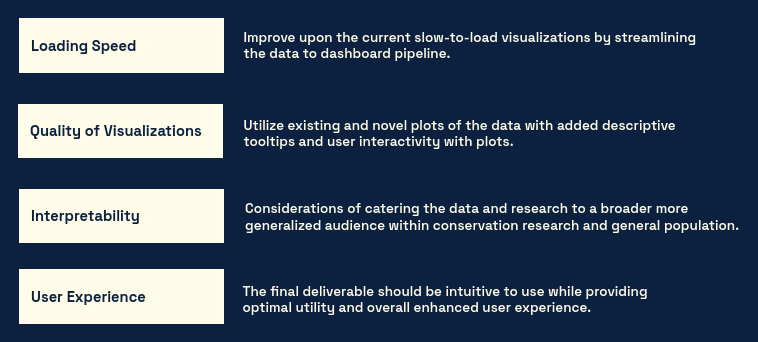
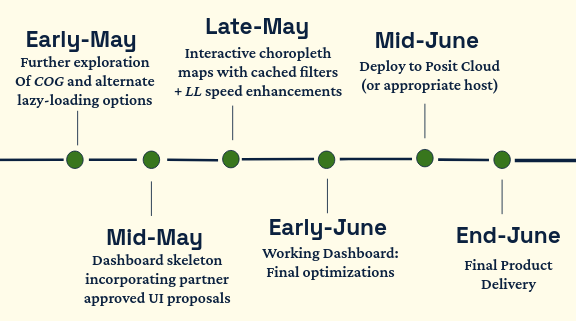

\newpage

## Executive Summary

The Boreal Avian Modelling Centre (BAM) requires a transition from static model visuals to a high-fidelity, interactive, analytic platform. The current [site](https://borealbirds.github.io/ "BAM static website"), which showcases Version 4 model outputs, is restricted to simple data tables and static summaries for 143 species of birds across boreal North America. Version 5 model results introduce improved raster predictions, spatially explicit density estimates, and habitat relationship metrics. We aim to highlight these improvements in the updated dashboard.

The proposed dashboard will be designed to be user-friendly and accessible to a wide range of audiences; including research and conservationists based users, as well as birding enthusiasts and the general public. This will allow users to interactively explore both version 4 and version 5 model outputs. Additionally, the dashboard serves as a landing page for visitors to the site providing easy-access links to existing tools in the BAM portfolio.

@fig-proposed-dashboard provides an illustration of our current mock-up of the proposed dashboard. The dashboard will include filters, an interactive map, and insightful summary charts/graphs/tables. Navigation will be based on tabs for minimal scrolling and intuitive searching. This *Shiny App* will be initially programmed in Python and hosted on Posit Connect Cloud.

{#fig-proposed-dashboard}

## Introduction

### Addressing the Issue

The project motivation is to improve upon and enhance the current static Boreal Avian Modelling Centre (BAM) website.

As the current website does not allow for user input or interaction, this limits the ability to dive in and explore the avian model outputs. Additionally, the current audience is made up of advanced users - both in statistical and subject knowledge. Ensuring a wider level of accessibility could expand end-user reachability.

### Background & Importance

A mandate of BAM's is to support migratory bird management and conservation across the Boreal region of North America for 143 species of birds. They do this through several data-driven tools that can be used to address different conservation challenges. These applications include, but are not limited to:

-   bird population and trend estimations

-   land-use planning

-   further understanding of avian-habitat relationships

-   the ability to investigate population decline of a specific species

To be able to properly address any challenge, the tools themselves should be simple and effective for anyone accessing them to use. This is especially important relating to conservation efforts and accessibility of information.

### Objectives

@fig-existing-website provides elements of what the current BAM website looks like. Our goal will be to improve upon it into what was illustrated in @fig-proposed-dashboard.

High level objectives include:

-   Update from static to dynamic website, changing based on user input - maintaining existing figures and visuals.
-   Add multiple filters, an interactive map, and additional summaries and visuals.
-   Accommodate historic and future model versions. This is for reproducibility and validation of performance. (Outputs from earlier models have been thoroughly vetted.)
-   Dashboard easy to use and understandable for the general public; since this will serve as a landing page for BAM, there will be links to other existing BAM products and general information.

{#fig-existing-website}

### The Product

The final deliverable product will be an interactive dashboard that allows users to explore the model outputs of both version 4 and version 5. We will be addressing each of our objectives to do so, as well as meeting with BAM regularly to include or exclude features that we discuss. @fig-dashboard-features showcases elements of the proposed dashboard.

In keeping with a simple and minimalist approach, we have limited the number of filters and visuals to only the most important. Additional components can be housed under navigation tabs. The aim is to require minimal scrolling with use of tabs and collating relating information together. This will make searching for information more straightforward and intuitive.

{#fig-dashboard-features}

\newpage

## Exploratory Data Analysis

### Basic EDA

The main data scope for the dashboard includes model outputs only. These files are stored on Google Drive and include the following:

-   Raster files - For each bird species, the main output of the model containing 3 bands: mean density, standard deviation of density, and the mean distance of species detection. These were saved in TIF format.
-   Excel files - Static metadata associated with the bird species, region, and importance of the features.
-   CSV files - The input to the model, including raw observations binned by Lat and Lon. Used to distinguish between different methods of bird spotting.

For EDA purposes, a single species of bird, the **Canada Warbler**, was used.

Initial EDA involved plotting the different color bands in the TIF @fig-raster-bands. This was helpful for investigating what to expect from the TIF files.

{#fig-raster-bands}

### Data Concerns and Constraints

Potential issues we found with the data include:

-   Finely detailed raster: The native TIF raster files are \~800K predictions per TIF output. This entire high-res output is unnecessarily loaded for every interactive adjustment; even when zooming into a specific region.
-   [Coordinate Reference System (CRS)](https://epsg.io/ "CRS EPSG lookup") adjustment: The TIFs arrive formatted with the EPSG:3978 (Statistics Canada Lambert) CRS . This does not allow for caching and every render triggers a full coordinate transformation pass.
-   Eager Loading of data: Every filter adjustment triggers a full TIF decode, CRS transformation, and PNG/COG encoding. This bogs down the UI resulting in a laggy and inefficient user experience.

To address this, we are exploring options using the [Cloud-Optimized GeoTIF](https://cogeo.org/ "Cloud-Optimized GeoTIF (COG)") format (COG). COG is analogous to Parquet for tabular data, using internal tiling and HTTP range requests to only render what is being displayed. We are also investigating alternate Lazy-Loading options within Shiny for R. We will also be discussing this with the BAM team to ensure subsequent dashboard maintainibility for when the project is handed over.

The initial EDA was conducted in *Jupyter Notebooks* and with a locally-run *Shiny App,* which can be reproduced by installing the conda [environment](https://github.com/UBC-MDS/Boreal-Birds/blob/main/environment.yml "environment.yml file") and following the instructions in the [README](https://github.com/UBC-MDS/Boreal-Birds/blob/main/README.md "Boreal-Birds README").

\newpage

## Data Science Approach

### Data Pipeline

@fig-data-pipeline maps out our main pipeline for the dashboard. Following is a breakdown of the individual components of the pipeline.

{#fig-data-pipeline}

#### Data Input

There are 2 data streams which we're ingesting into the dashboard: outputs from the model and static metadata. The model outputs consist of the different TIF files, one for each species, location, and year in the dataset. The metadata includes information relating to the bird species (including English names, Latin names, genus etc.), location, and region. These will primarily feed into the main filters of the dashboard.

Currently, these files are stored on a Google Drive which are subjected to extended loading and downloading times. To improve on speeds, we suggest pre-loading these model outputs to a SQL (or equivalent) database which can be queried through the dashboard's back-end for speedy friction-less responses. Another method which can be applied in congruence is to cache the most frequently loaded data. These approaches will enable fast retrieval and on-demand structured data validation. However, we will be discussing this with the BAM team to ensure long-term maintainability.

#### Preprocessing

There is different preprocessing required for both outlined data streams. Since we're dealing with discrete model outputs, the data format can be safely assumed to be standardized.

Before loading the data to the app, we perform some data validation checks on the metadata: column name validation, data type validation, and NaN management.

Preprocessing that needs to be done on the TIF file include: color band extraction, CRS validation, and conversion to Cloud Optimized GeoTIF (COG); or equivalent alternatives.

Our plan is to run these preprocessing steps in advance such that it is ready to be ingested into the dashboard at runtime.

#### App

The Shiny app consists of a server and UI. Basic render targets (incorporated by the server) include the following:

-   Bird metadata - A static table of metadata that can be sliced by filters.
-   Filters - The filters incorporate metadata from the excel file. These serve as lookup tables for the dashboard and will feed into the main filters / slicers in the UI.
-   Main raster - Simple loading of the different raster bands to memory.
-   Metrics - Extraction of metrics (mean, sd of abundance, distance from detectors), from raster file.

There is an opportunity for further data metrics derived from these base ones. This shall be explored at a later data and in consultation with BAM.

#### Front End

The front end of the dashboard includes the following visuals, at a minimum. There is an opportunity for additional visuals, based on client feedback and consultation. These will be addressed after the basic structure of the dashboard has been implemented.

-   @fig-dashboard-map An interactive map that follows the following format.
-   @fig-dashboard-bar-chart A bar chart showing the population densities by region.
-   @fig-dashboard-static-table A static table containing raw numeric metrics.

::: {#fig-front-end layout-nrow="2"}
{#fig-dashboard-map}

{#fig-dashboard-bar-chart}

{#fig-dashboard-static-table}

Front End Visuals
:::

\newpage

## Evaluation & Success Criteria

As seen in @fig-eval-success, our high-level evaluation criteria includes:

-   **Loading Speed: Data** $\rightarrow$ **Filters** $\rightarrow$ **UI**

-   **Quality of Visualizations**

-   **Interpretiblity & Accessibility**

-   **User Experience**

Loading speeds is the most objectively measurable success criteria and will be the easiest to time and quantify the improvements as they happen. The quality of visualizations will be measured by ensuring the loaded and filtered results and any calculations performed correspond to the correct species of bird, and that the visualization contains equal or greater quality to existing visualizations - this may also be by adding tool-tips and interactivity.

The last two key areas are related but not exclusive. Interpretibility remains a crucial component of the dashboard for anybody using the tools for any meaningful inference. The accessibility ties in to the overall user experience becoming simplified and more intuitive. The ultimate goal being to provide an improved communication of the data to the user, regardless of the user's background or domain expertise.

Success will also include the capstone partner satisfaction and enthusiasm with the final results. The overall goal is to incorporate the provided criteria, ideas, and vision into the new dashboard, as well as elaborating on and expanding its capabilities.

{#fig-eval-success width="554"}

\newpage

## Timeline

Our timeline has begun with initial EDA and mock dashboard design. As shown in @fig-timeline, we have mapped out our initial objectives that the dashboard needs to meet. Then comes the process of further exploration of loading options. Tangentially, we will be working on a skeleton of the front-end design and visuals with a sample of the data. This will helpful in getting feedback, and will be an iterative process as we incorporate updates and find better ways of presenting the visuals.

With an appropriate method of loading the data confirmed, we will then extend the dashboard to include more data and ensure this works. Here we will be incorporating feedback and adjustments, as needed.

Finally, we will deploy the dashboard, finalize documentation, and hand over the project to our BAM partner.

{#fig-timeline width="449"}

\newpage

## References

**Boreal Avian Modelling Centre**

-   Organisation website: <https://borealbirds.github.io/>
-   Google Earth Engine viewer: <https://borealbirds-gee.projects.earthengine.app/view/landbirdmodels>
-   BAM Shiny explorer: <https://borealbirds.shinyapps.io/bam_landbird_explorer/>
-   BAMexploreR R package: <https://github.com/borealbirds/BAMexploreR>
-   Landbird Models V5: <https://github.com/borealbirds/LandbirdModelsV5>
-   BAM website repository: <https://github.com/borealbirds/borealbirds.github.io>
-   Cloud Optimized GeoTIF (COG): <https://cogeo.org/>
-   Coordinate Reference System EPSG lookup: <https://epsg.io/>

**Capstone Project Working Repository**

-   UBC MDS Boreal-Birds: <https://github.com/UBC-MDS/Boreal-Birds>
-   README: <https://github.com/UBC-MDS/Boreal-Birds/blob/main/README.md>
